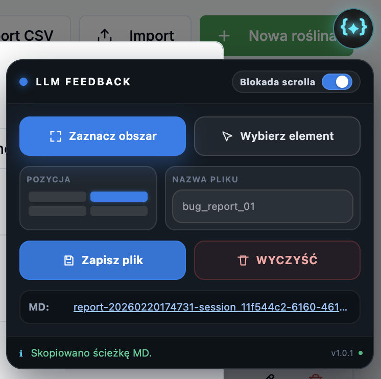

# LLM Feedback

Lokalne narzędzie do zbierania feedbacku UI z Chrome (bez chmury pośredniej).

## Wymagania

- Chrome
- Node.js

## Struktura

- `extension/` - rozszerzenie MV3
- `backend/` - lokalny backend (`POST /analyze`)
- `backend/reports/` - zapisane raporty

## 1) Uruchom backend

```bash
cd backend
npm start
```

Health check:

```bash
curl http://127.0.0.1:3030/health
```

## 2) Załaduj rozszerzenie

1. Otwórz `chrome://extensions`.
2. Włącz `Developer mode`.
3. Kliknij `Load unpacked`.
4. Wybierz katalog `extension/`.

## 3) Włącz rozszerzenie na domenie

Domyślnie rozszerzenie jest wyłączone na każdej domenie.

1. Wejdź na docelową stronę.
2. Kliknij ikonę rozszerzenia `LLM Feedback` w pasku rozszerzeń Chrome.
3. Kliknij `Włącz na tej domenie`.

Ustawienie jest zapamiętywane osobno per domena.

## 4) Jak używać na stronie

1. Kliknij pływającą ikonę `UI`, aby otworzyć panel.
2. Wybierz `Zaznacz obszar` albo `Wybierz element`.
3. Dodaj notatkę przy zaznaczeniu (przycisk `N`).
4. Powtarzaj dla kolejnych elementów/obszarów.
5. Opcjonalnie wpisz nazwę pliku.
6. Kliknij `Zapisz plik`.

Po udanym zapisie sesja jest automatycznie czyszczona.

### Szybki flow (ze screenem)



1. W panelu wybierz `Zaznacz obszar` albo `Wybierz element`.
2. Zaznacz problematyczny fragment strony.
3. Kliknij ikonę notatki `N` przy zaznaczeniu i dopisz, co jest nie tak.
4. Powtórz kroki 1-3 tyle razy, ile chcesz dodać zgłoszeń.
5. Kliknij `Zapisz plik`.
6. Na dole panelu pojawi się link do raportu (`MD`) - kliknięcie kopiuje pełną ścieżkę.
7. Wklej raport do LLM i poproś o poprawki zgłoszonych tematów.

### Akcje na zaznaczeniu

- `×` - usuwa zaznaczenie i powiązane notatki z bieżącej sesji.
- `N` - otwiera edytor notatki.
- `CSS` i `HTML` - dostępne tylko dla zaznaczenia elementu (nie dla obszaru).

### Panel i pozycja

- Pozycję widgetu/panelu (`4` rogi) można zmienić w panelu.
- Wybrana pozycja jest zapamiętywana i przywracana w kolejnych sesjach.
- Gdy panel jest otwarty, scroll strony jest domyślnie blokowany; przełącznik w panelu zmienia stan blokady.

## Jak działa popup rozszerzenia

Popup służy tylko do włączenia/wyłączenia rozszerzenia dla aktualnej domeny.

## Co trafia do raportu

- `user_note` dla każdego zgłoszenia.
- Zakres i kontekst elementu (`selector`, `tag`, `role`, tekst, snippet HTML).
- Kroki reprodukcji z auto-zbieranych zdarzeń.
- Błędy (`console.error`, `js.error`, `unhandledrejection`, `network.failure`).
- Screenshot per issue (crop zaznaczenia) oraz globalny screenshot viewportu.

## Pliki wyjściowe

Backend zapisuje parę plików:

- `<nazwa>.md`
- `<nazwa>.json`
- opcjonalnie folder `<nazwa>-assets/` ze screenshotami

W panelu na stronie widoczna jest ścieżka do `MD` (kliknięcie kopiuje pełną ścieżkę).

## Konfiguracja

Plik: `backend/config.json`

Najważniejsze pole:

- `outputDir` - katalog raportów

## Prywatność

Maskowane są m.in.:

- pola hasła,
- tokeny/sekrety pasujące do `sensitivePatterns`.
